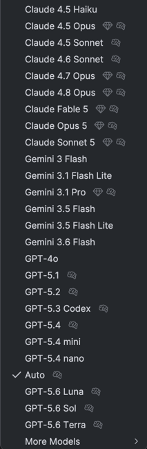
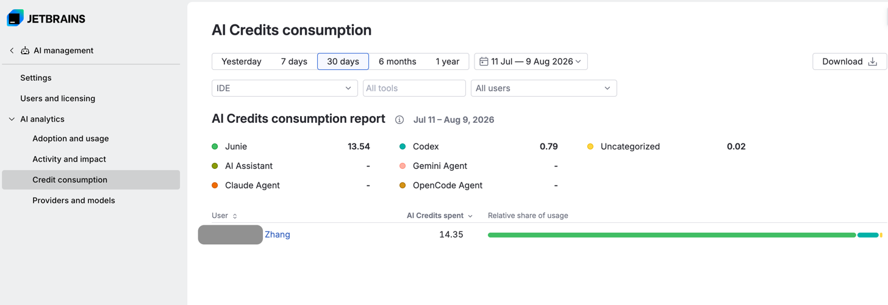
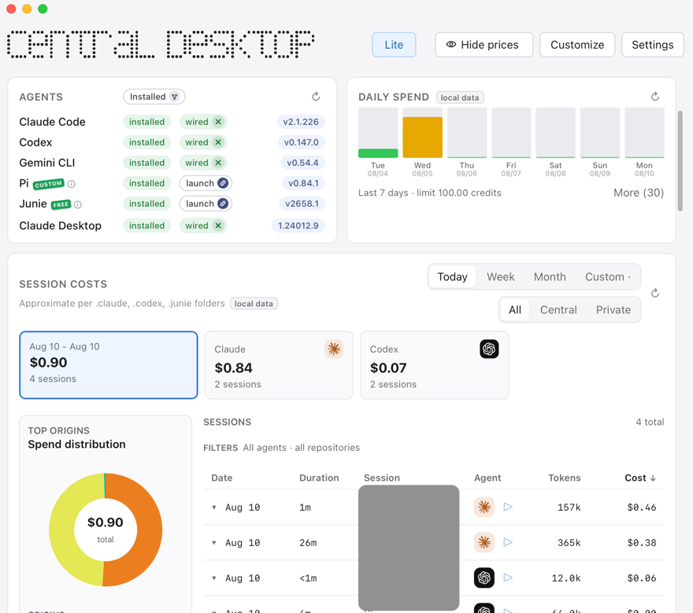
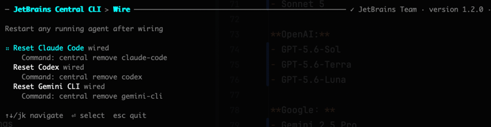

# ❓ 为什么是JetBrains AI

JetBrains AI 集成了**Google，Anthropic，OpenAI，（~~阿里通义**~~ 已于2026年7月下架） 提供的LLM，用量很大且不会掉速。

所有注册区域为**海外的** JetBrains 账户的用户都能试用 JetBrains AI。

JetBrains AI 兼容任何通过 **ACP（AI Coding Protocol）** 接入的 AI Coding Agent，包括但不限于：

- **Claude Code**（Anthropic）
- **Codex**（OpenAI）
- **Gemini**（Google）
- **Junie**（JetBrains）

目前通过 https://github.com/agentclientprotocol/registry 注册的 Agent 超过 30 个，包括：

| Agent | 开发方 |
|-------|--------|
| Claude Code | Anthropic |
| Codex ACP | OpenAI |
| Gemini | Google |
| Junie | JetBrains |
| GitHub Copilot | GitHub |
| GitHub Copilot CLI | GitHub |
| Cursor | Anysphere |
| Cline | — |
| Devin | Cognition |
| Goose | Block |
| Grok Build | xAI |
| Kimi | Moonshot AI |
| GLM ACP Agent | 智谱 AI |
| Qwen Code | 阿里通义 |
| CodeBuddy Code | 腾讯 |
| Mistral Vibe | Mistral |
| Poolside | Poolside |
| Factory Droid | Factory AI |
| Pi ACP | — |
| Fast Agent | — |
| Nova | — |
| Dirac | — |
| Agoragentic ACP | — |
| AMP ACP | — |
| Auggie | — |
| Autohand | — |
| Corust Agent | — |
| Crow CLI | — |
| DeepAgents | — |
| DimCode | — |
| Harn | — |
| Kilo | — |
| Minion Code | — |
| OpenCode | — |
| Qoder | — |
| Sigit | — |
| Stakpak | — |
| VTCode | — |
| Cortex Code | — |

## 可用模型

截止至 2026 年 8 月，JetBrains AI 支持以下最新大语言模型：

**Anthropic:**
- Opus 5
- Fable 5
- Sonnet 5

**OpenAI:**
- GPT-5.6-Sol
- GPT-5.6-Terra
- GPT-5.6-Luna

**Google：**
- Gemini 2.5 Pro
- Gemini 3.5 Flash
- Gemini 3.1 Flash Lite

在 AI Assistant 中能够随时切换使用。此外，AI Assistant 的聊天还允许使用由 LM Studio 和 Ollama 部署的本地模型。

## 企业版：JetBrains Central

企业版管理员可通过 **JetBrains Central** 获得集中化管理能力，包括：团队授权管理、模型访问控制、使用量监控等功能。

用户则可以通过 [JetBrains Central CLI](https://www.jetbrains.com/central-cli/) 来实现使用一个 JetBrains AI 帐户驱使多个 Agent 的能力。

更多有关 JetBrains Central 的介绍请参考[官网博客](https://blog.jetbrains.com/blog/2026/03/24/introducing-jetbrains-central-an-open-system-for-agentic-software-development/)。

## 订阅与定价

当你的 JetBrains 账号拥有 AI Pro 的订阅后，即可访问全部模型。

**AI Pro 的订阅不锁区，完全决定于你的网络环境，只要能访问 ChatGPT 和 ClaudeAI 即可解锁全部模型。**
