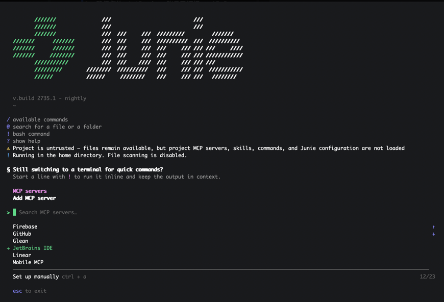
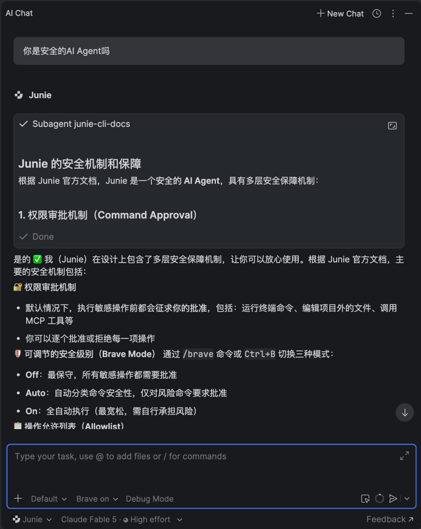

# 🚀 Junie 使用教程

Junie 是 JetBrains 开发的 AI Coding Agent，通过 ACP（AI Coding Protocol）协议与 JetBrains AI 集成，为开发者提供智能编码辅助。

## 什么是 Junie

Junie 是一个强大的 AI 编程助手，它包含：

- **Junie CLI**：在终端中使用
- **Junie in JetBrains IDEs**：在 JetBrains IDE 中的 AI Chat 窗口里使用
- **Junie in CI/CD**：在 CI/CD 环境中使用，包括 GitHub Actions、GitLab CI、Jenkins 等

## 开始使用 Junie

### 前置条件

1. 确保您的 JetBrains 账号已订阅 **AI Pro**
2. 已正确配置区域设置（参见 [区域设置指南](/docs/category/region-settings)）
3. 网络环境可以访问 JetBrains AI 服务

### Junie CLI 文档

Junie 提供了命令行工具（CLI），让您可以在终端中使用 AI 辅助功能。

:::tip 官方文档 完整的 Junie CLI 使用方法请参考官方文档：

**[Junie CLI 官方文档](https://junie.jetbrains.com/docs/junie-cli.html)**
:::

### 在 IDE 中使用 Junie

Junie 已经集成在 JetBrains AI Assistant 中：

1. 打开任意 JetBrains IDE
2. 确保 AI Assistant 插件已启用
3. 在代码编辑器中，您可以：
    - 使用快捷键调用 AI 助手
    - 在代码上右键选择 AI 相关功能
    - 在聊天窗口中与 Junie 对话

### 相关链接

- [JetBrains AI 介绍](/docs/intro)
- [区域设置指南](/docs/category/region-settings)
- [Junie 官方文档](https://junie.jetbrains.com/docs/junie-cli.html)
